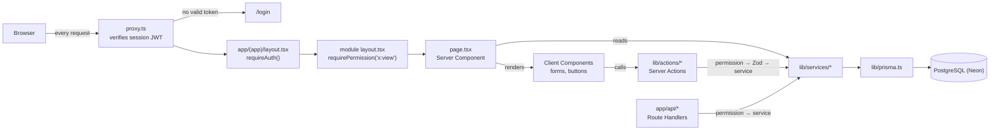

# Architecture

How Priinteve Business OS is put together: the layers, how a request moves through them, and the design decisions that shape the code.

Related: [AUTHORIZATION.md](./AUTHORIZATION.md) · [DATABASE.md](./DATABASE.md) · [DOCUMENTS.md](./DOCUMENTS.md) · [MODULES.md](./MODULES.md)

---

## Overview

The app is a single Next.js 16 (App Router) application. There is no separate backend: pages read data directly on the server, and mutations go through Server Actions. Database access lives in `lib/services/` (with four exceptions, listed under [Services](#services)).



Not every module has its own `layout.tsx` gate — see [Route protection](./AUTHORIZATION.md#route-protection).

## Directory layout

| Path | Contents |
|---|---|
| `app/(auth)/` | Login page and its centred layout |
| `app/(app)/` | Every signed-in page, one folder per module, plus the group's `layout.tsx`, `loading.tsx`, `error.tsx`, `not-found.tsx` |
| `app/api/` | Route handlers: Auth.js (`auth/[...nextauth]`), project timer API, iCal calendar feed |
| `app/layout.tsx` | Root layout: fonts, `ThemeProvider`, `SessionProvider`, `TooltipProvider`, `Toaster` |
| `app/page.tsx` | Redirects `/` to `/dashboard` |
| `components/<module>/` | Module UI: forms, lists, detail views, action buttons |
| `components/documents/` | Quotation/invoice document template ([DOCUMENTS.md](./DOCUMENTS.md)) |
| `components/shared/` | Cross-module building blocks (see [Shared components](#shared-components)) |
| `components/ui/` | shadcn/ui primitives (Radix-based `radix-nova` style, see `components.json`) |
| `components/layout/` | `AppShell`, sidebar, topbar, theme toggle |
| `features/users/` | User form and status toggle — the only `features/` folder |
| `lib/services/` | All Prisma access and business logic; `accounting/` holds the double-entry services |
| `lib/actions/` | Server Actions (`"use server"`) |
| `lib/validations/` | Zod schemas and form defaults |
| `lib/auth/` | Permission map, session helpers, API error mapping, password hashing |
| `lib/money.ts` | All currency math (integer paise) |
| `lib/pdf/exporter.ts` | DOM-to-PDF export used by "Download PDF" and report exports |
| `lib/nav-config.tsx` | Sidebar sections and topbar quick actions, each with a required permission |
| `lib/format.ts`, `lib/time-format.ts`, `lib/utils.ts` | Date/duration formatting and the `cn()` class helper |
| `prisma/` | `schema.prisma`, seed scripts, and a stale `migrations/` folder |
| `scripts/` | Verification scripts, run with `npx tsx` ([TESTING.md](./TESTING.md)) |
| `types/next-auth.d.ts` | Auth.js type augmentation (`id`, `role`, `checkedAt`) |
| `proxy.ts` | Next.js 16 proxy (the renamed `middleware`) |
| `auth.ts` | Auth.js configuration |
| `next.config.ts` | Rewrites `/projects/:id/timer/:action` and `/projects/:id/time-entries` to the API routes |

## Route groups

| Group | Purpose | Layout behaviour |
|---|---|---|
| `app/(auth)` | `/login` | Centred card layout, no app chrome |
| `app/(app)` | All business pages | Calls `requireAuth()` and redirects to `/login` on failure, then wraps children in `AppShell` |
| `app/api` | Route handlers | No layout; each handler checks permissions itself |

Inside `app/(app)`, most modules add a small `layout.tsx` that calls `requirePermission("<module>:view")` and redirects to `/dashboard` if it fails. Modules whose routes span several folders (finance, accounting, accounts, reports) check permissions in each `page.tsx` instead.

## Rendering model

- **Server Components by default.** Every `page.tsx` is an async Server Component that calls services directly and passes plain data to Client Components.
- **Always dynamic.** Every page under `app/(app)` and every API route exports `export const dynamic = "force-dynamic"`. Pages with no dynamic input (for example `/dashboard`, `/settings`) would otherwise be rendered once at build time.
- **Loading and errors.** Each module folder has a `loading.tsx` skeleton. `app/(app)/error.tsx` shows the error message with a "Try again" button; `not-found.tsx` handles missing records (`notFound()`).
- **URL-driven lists.** List pages read filters, search and page number from `searchParams`. The shared toolbar, filter select, date filter and pagination components (`components/shared/table-*.tsx`) update the URL, which re-renders the page on the server.

## Client Components

Client Components (`"use client"`) handle interactivity: forms (`react-hook-form` with `@hookform/resolvers/zod`), confirm dialogs, timers, charts (`recharts`) and PDF export.

> **Rule:** a Server Component can only pass serializable data or a Server Action reference to a Client Component — never a plain closure or event handler. Each list-page delete button is therefore its own small Client Component that takes an `id` and builds its own `onConfirm` (for example `components/customers/delete-customer-item.tsx`).

## Server Actions

All mutations from the UI go through `lib/actions/*.ts`. They follow one pattern:

```ts
export async function createInvoiceAction(values: InvoiceFormValues): Promise<FormActionResult> {
  await requirePermission("invoices:create");          // 1. authorize (throws on failure)
  const parsed = invoiceFormSchema.safeParse(values);   // 2. validate
  if (!parsed.success) {
    return { success: false, message: "Please fix the highlighted fields.", fieldErrors: flattenZodError(parsed.error) };
  }
  try {
    const invoice = await invoiceService.createInvoice(parsed.data); // 3. business logic
    revalidatePath("/invoices");                                    // 4. refresh cached pages
    return { success: true, id: invoice.id };
  } catch (err) {
    return { success: false, message: friendlyError(err) };        // 5. user-facing error
  }
}
```

- `FormActionResult`, `flattenZodError` and `friendlyError` live in `lib/actions/utils.ts`. `friendlyError` turns a Prisma unique-constraint error (`P2002`) into "A record with these details already exists." and otherwise returns the error's message.
- The permission check runs **before** the `try`, so a denied call throws instead of returning `{ success: false }`.
- Most schemas come from `lib/validations/*`. The accounting actions (`accounts.ts`, `journal.ts`, `periods.ts`) define their Zod schemas inline and accept `values: unknown`.

## Services

`lib/services/*.ts` is where database access belongs. Four files currently import `prisma` directly instead: `app/(app)/projects/new/page.tsx` and `app/(app)/projects/[id]/edit/page.tsx` (active users for the assignee picker), `app/(app)/finance/tax/page.tsx` (invoice and expense rows for the GST page) and `app/api/calendar/feed/route.ts`. Don't add more; put new queries in a service.

Services:

- implement the business rules ([BUSINESS-LOGIC.md](./BUSINESS-LOGIC.md)) and throw `Error` with a user-readable message when a rule is broken;
- open transactions for multi-step writes, using `TX_OPTIONS` from `lib/prisma.ts`;
- write activity-feed rows with `logActivity()` (`lib/services/activity.ts`), which is best-effort: if the insert fails it retries outside the transaction and then gives up silently;
- in most read functions (`list*`, `get*Detail`), catch errors, log them with `console.error`, and return an empty result or `null`. A database failure therefore usually shows up as an empty list or a 404 page, not an error page.

Services do **not** check permissions. The one authorization rule inside a service is project-timer ownership ([PROJECTS.md](./PROJECTS.md#timer-ownership)).

## Prisma layer

`lib/prisma.ts` exports:

- `prisma` — one `PrismaClient`, cached on `globalThis` outside production so hot reloads don't open new connection pools. Errors are logged through an event listener that drops Neon's idle-disconnect messages and prints everything else ([TROUBLESHOOTING.md](./TROUBLESHOOTING.md#neon-idle-disconnect-errors-in-the-terminal)). Warnings are printed in development only.
- `TX_OPTIONS` — `{ maxWait: 15000, timeout: 30000 }` for interactive transactions, sized for Neon cold starts.

See [DATABASE.md](./DATABASE.md) for models, constraints and transactions.

## Authentication and authorization flow

1. `proxy.ts` runs on every request except static assets. Public paths (`/login`, `/api/auth`, `/_next`, `/favicon.ico`, `/public`) and static image files (`.png`, `.svg`, `.jpg`, `.jpeg`, `.webp`, `.ico`) pass through. Otherwise it decrypts the session JWT with `getToken()`; if that fails it redirects to `/login?callbackUrl=<path>`.
2. `app/(app)/layout.tsx` calls `requireAuth()`. This runs the Auth.js `jwt` callback, which re-checks the user's role and status in the database about once a minute.
3. The module `layout.tsx` (or the page itself) calls `requirePermission("<module>:view")`.
4. Every Server Action and API handler calls `requirePermission()` for the specific operation.

Details, including the permission matrix: [AUTHORIZATION.md](./AUTHORIZATION.md).

## API routes

| Route | Used by |
|---|---|
| `app/api/auth/[...nextauth]` | Auth.js (sign-in, session, sign-out) |
| `app/api/projects/**` | JSON API for projects and timers. The app's own UI does **not** call these; it uses Server Actions. `next.config.ts` also exposes the timer and time-entry routes under `/projects/:id/...`. |
| `app/api/calendar/feed` | iCal feed of events, tasks, deliveries and production due dates |

## Shared components

| Component | Purpose |
|---|---|
| `table-toolbar.tsx`, `table-filter-select.tsx`, `table-date-filter.tsx`, `table-pagination.tsx` | URL-driven search, filters and paging for list pages |
| `confirm-dialog.tsx` | Confirmation dialog wrapping an async `onConfirm` |
| `customer-combobox.tsx` | Searchable customer picker with inline quick-create (`components/customers/quick-create-customer-dialog.tsx`) |
| `document-items-editor.tsx`, `document-totals-summary.tsx`, `product-picker-button.tsx` | Line-item editor and live totals shared by the quotation and invoice forms |
| `status-badge.tsx` | Status badges for quotations, invoices, timers and more |
| `activity-timeline.tsx` | Renders `ActivityLog` rows |
| `page-header.tsx`, `stat-card.tsx`, `empty-state.tsx`, `field.tsx`, `row-actions.tsx` | Layout and form helpers |

## Documents and PDF

Quotation and invoice detail pages render `components/documents/document-preview.tsx`, an A4 letterhead built from Tailwind classes. Two outputs come from the same markup:

- **Print** — `window.print()` with the print CSS in `app/globals.css`;
- **Download PDF** — `lib/pdf/exporter.ts` rasterizes the element and paginates it with jsPDF.

Full details: [DOCUMENTS.md](./DOCUMENTS.md).

## Accounting integration

Business events post double-entry journal entries automatically through `lib/services/accounting/auto-accounting.ts`:

- an invoice is marked Sent;
- a payment is recorded or deleted;
- a Recorded expense is created or deleted;
- an invoice is cancelled.

Reports (P&L, balance sheet, cash flow, GST) read only `POSTED` journal entries. See [BUSINESS-LOGIC.md](./BUSINESS-LOGIC.md#accounting).

## Key design decisions

| Decision | Where | Why |
|---|---|---|
| Money is integer paise | `lib/money.ts`, every `*Paise` column | No floating-point rounding errors |
| "Overdue" is derived, not stored | `deriveInvoiceStatus()` in `lib/services/invoices.ts` | No background jobs exist; the status is always current |
| Totals are recomputed on the server | Quotation, invoice and order services | Client-posted totals can't be trusted |
| JWT sessions with a periodic DB re-check | `auth.ts` | No session table, but deactivation and role changes still take effect within about a minute |
| Schema applied with `prisma db push` | `package.json` | `prisma/migrations/` is a leftover from the SQLite era |
| Permissions are a static role map | `lib/auth/permissions.ts` | Two roles; no permission tables in the database |
| No scheduler or queue | — | Every status is derived at read time or changed by a user action |

## Code that exists but is not wired up

The following are in the repository but not used by any page. Check before building on them.

- `Attachment` model; `lib/services/attachments.ts` and `components/shared/attachment-uploader.tsx` are empty files.
- `components/accounting/statement-view.tsx`, `lib/actions/statements.ts` and `lib/services/accounting/statements.ts` — customer/vendor statements; no route renders `StatementView`.
- `lib/services/finance.ts` — used only by `scripts/test-flow.ts`; the `/finance` page reads the accounting services instead.
- `components/finance/*` — not imported anywhere.
- `lib/pdf/generate-document-pdf.ts` — re-exports `exportElementToPdf`; nothing imports it.
- `isDateInOpenPeriod()` and `getOpenPeriods()` in `lib/services/accounting/periods.ts`, and `postJournalEntry()` in `journal.ts`.
- The `invoices:delete` and `production:update_any` permissions — nothing checks them.
- Dependencies in `package.json` that no source file imports: `@base-ui/react`, `@tiptap/*`, `decimal.js`, `@paralleldrive/cuid2`.
