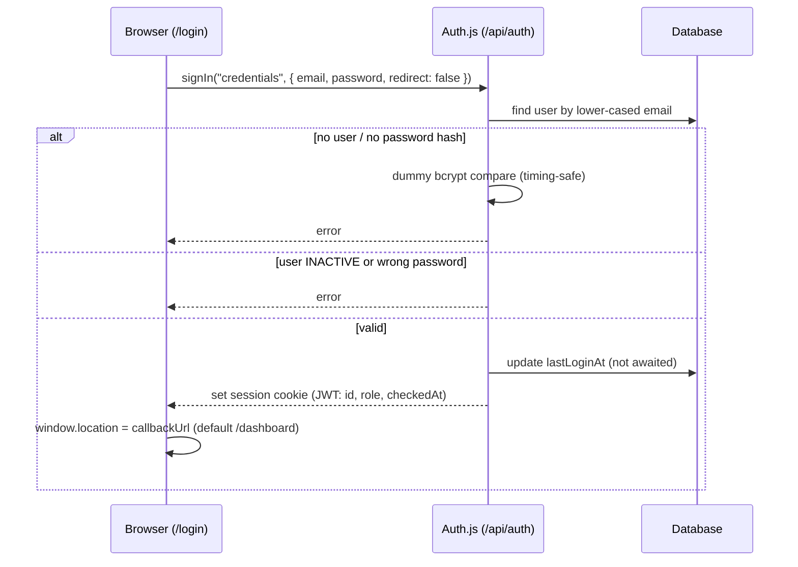

# Authentication and Authorization

Who can sign in, how sessions are checked, and who can do what. Everything here is enforced by the code listed in each section.

Related: [ARCHITECTURE.md](./ARCHITECTURE.md) · [PROJECTS.md](./PROJECTS.md) · [DEPLOYMENT.md](./DEPLOYMENT.md)

---

## Summary

| Item | Implementation |
|---|---|
| Provider | Auth.js v5 (`next-auth` `5.0.0-beta.32`), **Credentials** provider only (email + password) — `auth.ts` |
| Password storage | bcrypt, 12 salt rounds — `lib/auth/password.ts` |
| Session strategy | JWT in an encrypted cookie; no session table. Auth.js default lifetime: expires after 30 days idle, refreshed every 24 hours. |
| Roles | `ADMIN`, `EMPLOYEE`, `CLIENT` (`UserRole` enum) |
| Permissions | Static role → permission map in `lib/auth/permissions.ts` |
| Server helpers | `requireAuth`, `requireRole`, `requirePermission`, `checkPermission`, `getSession` — `lib/auth/session.ts` |
| Error types | `AuthenticationError` (401), `AuthorizationError` (403) — `lib/auth/session.ts` |
| API error mapping | `toApiErrorResponse()` — `lib/auth/api.ts` |

## Three layers of protection

Keep these separate when you change anything. Hiding a button is never the protection.

| Layer | What it does | Where | Enough on its own? |
|---|---|---|---|
| **UI visibility** | Hides sidebar items and topbar quick actions the role lacks | `components/layout/sidebar-nav.tsx`, `topbar.tsx`, using `ROLE_PERMISSIONS` and `lib/nav-config.tsx` | No — cosmetic only |
| **Route protection** | Stops unauthenticated requests and blocks pages the role can't view | `proxy.ts`, `app/(app)/layout.tsx`, module `layout.tsx` files, page-level checks | No — pages don't gate individual actions |
| **Server-side authorization** | Checks the exact permission for every mutation and API call | `requirePermission()` at the top of every Server Action and API handler | Yes — this is the real control |

Pages do **not** hide action buttons by role. An Employee who opens a record sees buttons such as Delete, and create forms such as `/invoices/new` load for anyone with the module's `:view` permission. The Server Action rejects the request when it's submitted.

## Login flow

- The form (`app/(auth)/login/page.tsx`) validates the email format and a non-empty password with Zod before calling `signIn`.
- Any failure shows "Invalid email or password. Please try again."
- `authorize()` returns `null` on any exception, so database errors also show as a failed login.

## Session validation

### 1. `proxy.ts` — every request

- Public paths pass through: `/login`, `/api/auth`, `/_next`, `/favicon.ico`, `/public`. The matcher also skips `_next/static`, `_next/image`, `favicon.ico` and static image files (`.png`, `.svg`, `.jpg`, `.jpeg`, `.webp`, `.ico`) so the logo loads on the login page and for clients.
- For anything else it calls `getToken({ req, secret: AUTH_SECRET })`, which decrypts the session cookie and checks its expiry. It does not touch the database.
- No valid token → redirect to `/login?callbackUrl=<path>`. This also applies to API routes, which receive a redirect rather than a 401.

Over HTTPS, Auth.js names the cookie `__Secure-authjs.session-token` (the name is also the encryption salt), so `proxy.ts` tries `getToken({ secureCookie: true })` first and falls back to the plain `authjs.session-token` used on `http://localhost`.

### 2. `auth.ts` `jwt` callback — role and status re-check

The token stores `id`, `role` and `checkedAt`. Whenever the session is read (`auth()`), the callback:

1. returns `null` (signed out) if the token has no `id`;
2. keeps the token as-is if `checkedAt` is less than 60 seconds old (`USER_RECHECK_INTERVAL_MS`);
3. otherwise reads the user's `role` and `status` from the database:
   - user missing or not `ACTIVE` → returns `null`, which ends the session;
   - otherwise copies the current `role` into the token and updates `checkedAt`;
   - on a database error, keeps the last known values instead of signing the user out.

The `session` callback copies `id` and `role` onto `session.user`. The types are augmented in `types/next-auth.d.ts`.

### 3. `app/(app)/layout.tsx` — every app page

Calls `requireAuth()` and redirects to `/login` if there is no live session. This is what actually signs out a deactivated user whose cookie is still cryptographically valid.

## Roles and permissions

`ADMIN` has every permission. `EMPLOYEE` has the staff operational subset below. `CLIENT` is strictly scoped to their own projects, task requests, and read-only timer tracking.

| Area | Permission | Admin | Employee | Client |
|---|---|:-:|:-:|:-:|
| Customers | `customers:view`, `customers:create`, `customers:edit` | ✓ | ✓ | — |
| | `customers:delete` | ✓ | — | — |
| Products | `products:view` | ✓ | ✓ | — |
| | `products:create`, `products:edit`, `products:delete` | ✓ | — | — |
| Quotations | `quotations:view`, `quotations:create`, `quotations:edit`, `quotations:convert` | ✓ | ✓ | — |
| | `quotations:delete` | ✓ | — | — |
| Orders | `orders:view`, `orders:create`, `orders:edit`, `orders:update_status` | ✓ | ✓ | — |
| | `orders:delete` | ✓ | — | — |
| Invoices | `invoices:view` | ✓ | ✓ | — |
| | `invoices:create`, `invoices:edit`, `invoices:delete` | ✓ | — | — |
| Payments | `payments:view` | ✓ | ✓ | — |
| | `payments:record`, `payments:delete` | ✓ | — | — |
| Production | `production:view`, `production:update_assigned` | ✓ | ✓ | — |
| | `production:create`, `production:update_any` | ✓ | — | — |
| Deliveries | `deliveries:view`, `deliveries:create`, `deliveries:update_status` | ✓ | ✓ | — |
| Expenses | `expenses:view`, `expenses:create`, `expenses:edit`, `expenses:delete` | ✓ | — | — |
| Vendors | `vendors:view`, `vendors:create`, `vendors:edit` | ✓ | — | — |
| Finance & accounting | `finance:view`, `accounting:view`, `accounting:manage`, `journal:view`, `journal:create`, `tax:view`, `reports:view`, `statements:view` | ✓ | — | — |
| Tasks | `tasks:view`, `tasks:create` | ✓ | ✓ | ✓ (own projects) |
| | `tasks:edit`, `tasks:delete` | ✓ | ✓ | ✓ (own created tasks only) |
| Notes | `notes:view`, `notes:create`, `notes:edit`, `notes:delete` | ✓ | ✓ | — |
| Calendar | `calendar:view`, `calendar:create` | ✓ | ✓ | — |
| Projects | `projects:view` | ✓ | ✓ (assigned) | ✓ (own customer, read-only) |
| | `projects:create`, `projects:edit` | ✓ | ✓ | — |
| | `projects:timer` | ✓ | ✓ (assigned) | — |
| | `projects:approve_time` | ✓ | — | — |
| | `projects:delete` | ✓ | — | — |
| Settings | `settings:view`, `settings:edit` | ✓ | — | — |
| Users | `users:manage` | ✓ | — | — |

> [!NOTE]
> `production:update_assigned` does **not** restrict updates to jobs assigned to the user. `updateProductionJobStatusAction` checks only the permission, and the service does not compare `assignedToId`. Any Employee can change the stage of any production job.

## Route protection

Failed page-level checks redirect to `/dashboard` unless noted. All routes also require a session (`proxy.ts` + the `(app)` layout).

| Route | Gate | Permission |
|---|---|---|
| `/dashboard` | none beyond sign-in | — (shows revenue, expense, profit and outstanding totals to every signed-in user) |
| `/planner` | none beyond sign-in | — |
| `/projects/**` | `layout.tsx` | `projects:view` |
| `/customers/**` | `layout.tsx` | `customers:view` |
| `/products/**` | `layout.tsx` | `products:view` |
| `/quotations/**` | `layout.tsx` | `quotations:view` |
| `/orders/**` | `layout.tsx` | `orders:view` |
| `/invoices/**` | `layout.tsx` | `invoices:view` |
| `/payments/**` | `layout.tsx` | `payments:view` |
| `/production/**` | `layout.tsx` | `production:view`; `/production/new` also needs `production:create` (redirects to `/production`) |
| `/deliveries/**` | `layout.tsx` | `deliveries:view`; `/deliveries/new` also needs `deliveries:create` (redirects to `/deliveries`) |
| `/calendar/**` | `layout.tsx` | `calendar:view` |
| `/tasks/**` | `layout.tsx` | `tasks:view` |
| `/notes/**` | `layout.tsx` | `notes:view` |
| `/expenses/**` | `layout.tsx` + list page | `expenses:view` |
| `/vendors/**` | `layout.tsx` + list page | `vendors:view` |
| `/users/**` | `layout.tsx` + each page | `users:manage` |
| `/settings` | page | `settings:view` |
| `/finance`, `/finance/receivables`, `/finance/payables` | page | `finance:view` |
| `/finance/tax` | page | `tax:view` |
| `/accounts`, `/accounts/cash-bank` | page | `accounting:view` |
| `/accounts/new`, `/accounting/periods` | page | `accounting:manage` |
| `/accounting/journal`, `/accounting/journal/[id]`, `/accounting/ledger` | page | `journal:view` |
| `/accounting/journal/new` | page | `journal:create` (redirects to `/accounting/journal`) |
| `/reports/profit-loss`, `/reports/balance-sheet`, `/reports/cash-flow` | page | `reports:view` |

Module `layout.tsx` gates check only `:view`. Create and edit pages such as `/invoices/new` or `/products/[id]/edit` have no page-level create/edit check; the Server Action enforces it on submit.

## Server Action protection

Every exported function in `lib/actions/*.ts` calls `requireAuth()` or `requirePermission()` before doing anything else:

| File | Action → permission |
|---|---|
| `customers.ts` | create → `customers:create`; update → `customers:edit`; delete (both variants) → `customers:delete` |
| `products.ts` | create/update/delete → `products:create` / `products:edit` / `products:delete` |
| `quotations.ts` | create, duplicate → `quotations:create`; update, change status → `quotations:edit`; convert to invoice → `quotations:convert`; delete → `quotations:delete` |
| `orders.ts` | create, convert quotation to order → `orders:create`; update → `orders:edit`; update status → `orders:update_status`; delete → `orders:delete` |
| `invoices.ts` | create → `invoices:create`; update, mark sent, cancel → `invoices:edit` |
| `payments.ts` | create → `payments:record`; delete → `payments:delete` |
| `production.ts` | create → `production:create`; update stage → `production:update_assigned` |
| `deliveries.ts` | create → `deliveries:create`; update status → `deliveries:update_status` |
| `expenses.ts` | create/update/delete → `expenses:create` / `expenses:edit` / `expenses:delete` |
| `vendors.ts` | create → `vendors:create`; update **and delete** → `vendors:edit` |
| `tasks.ts` | create → `tasks:create`; update, toggle status, move (drag and drop) → `tasks:edit`; delete → `tasks:delete` |
| `notes.ts` | create → `notes:create`; update, toggle pin → `notes:edit`; delete → `notes:delete` |
| `calendar.ts` | create, update **and delete** → `calendar:create` |
| `projects.ts` | create/update/delete → `projects:create` / `projects:edit` / `projects:delete`; start/pause/resume/stop timer → `projects:timer` |
| `accounts.ts`, `periods.ts` | all → `accounting:manage` |
| `journal.ts` | create, reverse → `journal:create` |
| `statements.ts` | both → `statements:view` |
| `settings.ts` | company settings, numbering → `settings:edit` |
| `users.ts` | all → `users:manage` |
| `dashboard.ts` | revenue chart range → `requireAuth()` only |

The check runs before the action's `try` block, so a denied action **throws** (the client's call rejects) rather than returning `{ success: false }`.

## API protection

| Route | Method | Permission | Error responses |
|---|---|---|---|
| `/api/projects` | GET | `projects:view` | 401 / 403 / 400 |
| `/api/projects` | POST | `projects:create` | 400 with Zod details on invalid body |
| `/api/projects/[id]` | GET / PUT / DELETE | `projects:view` / `projects:edit` / `projects:delete` | 404 if not found (GET) |
| `/api/projects/[id]/timer/start`, `.../resume` | POST | `projects:timer` | **409** if the project or user already has a running timer |
| `/api/projects/[id]/timer/pause`, `.../stop` | POST | `projects:timer` | **403** if the running timer belongs to someone else |
| `/api/projects/[id]/timer/status`, `/api/projects/[id]/time-entries` | GET | `projects:view` | Clients receive approved entries only |
| `/api/time-entries/[id]/approve` | POST / DELETE | `projects:approve_time` | Approve / unapprove one entry; a running entry can't be approved |
| `/api/projects/[id]/time-entries/approve` | POST | `projects:approve_time` | Approves all completed, unapproved entries of the project |
| `/api/projects/[id]/assignable-users` | GET | `tasks:view` | Admins, assigned employees and the project's client users (id, name, role); 404 if the project isn't visible |
| `/api/calendar/feed` | GET | **none in the handler** — only the `proxy.ts` session check | 500 on error |
| `/api/auth/*` | — | public (Auth.js) | |

`toApiErrorResponse(err)` maps `AuthenticationError` → 401, `AuthorizationError` → 403 and any other error → 400 with the error's message. A request without a valid session cookie never reaches a handler; `proxy.ts` redirects it to `/login`.

## Service-layer authorization

Services (`lib/services/*`) assume the caller has already been authorized. They enforce business rules but not permissions, with one exception: project timers.

### Project timer ownership

Implemented in `lib/services/projects.ts`; details in [PROJECTS.md](./PROJECTS.md#timer-ownership).

- **Pause** and **stop** compare the running entry's `userId` with the caller and throw "You can only control your own timer." if they differ. There is no admin override.
- **Start** and **resume** always create a new entry owned by the caller. They are refused if the project already has a running entry, or if the caller has a running entry on any project.
- **Stop** also marks every `PAUSED` entry on the project as `COMPLETED`, whoever created it.
- Setting a project's status to `COMPLETED` (edit form, `projects:edit`) closes all running and paused entries, whoever owns them.

## Error handling

| Where | On `AuthenticationError` | On `AuthorizationError` |
|---|---|---|
| `app/(app)/layout.tsx` | redirect `/login` | — |
| Module `layout.tsx` / page checks | redirect `/dashboard` (or the module list) | same |
| Server Actions | thrown to the client | thrown to the client |
| API routes | 401 JSON | 403 JSON |

## User status and deactivation

- Users are managed at `/users` (`users:manage`). Actions: create (password required, minimum 8 characters), edit (optional new password), change password, activate, deactivate.
- You can't deactivate your own account (`deactivateUserAction`).
- An `INACTIVE` user can't sign in (`authorize()` checks status).
- An already signed-in user who is deactivated, deleted, or has their role changed is picked up by the next re-check, within about a minute ([Session validation](#2-authts-jwt-callback--role-and-status-re-check)). A deactivated user is then redirected to `/login` on their next page load.
- The app has no user delete action.

## Other security notes

- **Timing-safe login:** an unknown email still runs a bcrypt comparison against a dummy hash.
- **No login rate limiting or lockout** exists in the code.
- **`callbackUrl` is not validated.** After a successful login, `app/(auth)/login/page.tsx` sets `window.location.href` to the `callbackUrl` query parameter as-is, so a crafted link can send a user to an external site after they sign in.
- **iCal feed:** `/api/calendar/feed` has no permission check of its own. Because `proxy.ts` requires a session cookie, external calendar apps that fetch the URL without the cookie are redirected to `/login` rather than receiving the feed.
- **`AUTH_SECRET`** signs and encrypts every session. Changing it signs everyone out. Never commit it; `.env` is git-ignored and only `.env.example` (placeholders) is tracked.
- **Passwords** are hashed with bcrypt in `lib/services/users.ts` and never returned by user queries; they `select` explicit fields without `passwordHash`.
