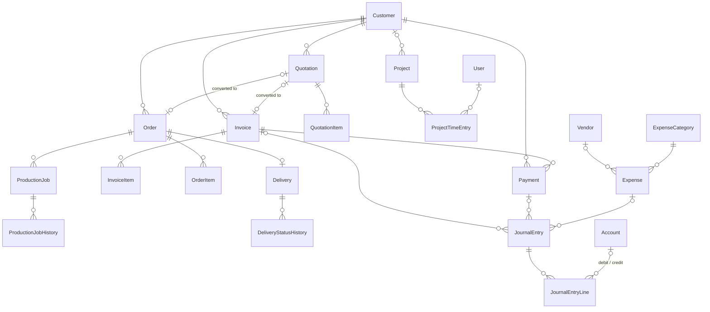

# Database

The data model, its constraints, and the rules for changing it. The source of truth is `prisma/schema.prisma`.

Related: [BUSINESS-LOGIC.md](./BUSINESS-LOGIC.md) · [DEVELOPMENT.md](./DEVELOPMENT.md) · [TROUBLESHOOTING.md](./TROUBLESHOOTING.md)

---

## Technology

| Item | Value |
|---|---|
| Database | PostgreSQL, hosted on Neon |
| ORM | Prisma 6 (`prisma` and `@prisma/client` `^6.19.3`), generator `prisma-client-js` |
| Runtime connection | `DATABASE_URL` — the Neon **pooled** connection string |
| Schema changes | `DIRECT_URL` — the Neon **direct** connection string (`directUrl` in the datasource) |
| Client | `lib/prisma.ts` — a single shared `PrismaClient` |

## Changing the schema

> [!IMPORTANT]
> Apply schema changes with `npm run db:push` (`prisma db push`). Do **not** use `prisma migrate`: `prisma/migrations/` is a leftover from the SQLite era (`migration_lock.toml` still says `provider = "sqlite"`) and does not match the database.

1. Edit `prisma/schema.prisma`.
2. On Windows, stop `npm run dev` first — it locks Prisma's query-engine file.
3. Run `npm run db:push`. This updates the database and regenerates the Prisma client.
4. If the change would drop data, `db push` stops and asks for confirmation. Try it on a Neon branch first.

## Conventions

- **IDs:** `String @id @default(cuid())`.
- **Timestamps:** most models have `createdAt @default(now())` and `updatedAt @updatedAt`.
- **Money:** `Int` columns ending in `Paise` (1 rupee = 100 paise). Never store rupees as floats. See [Money storage](#money-storage).
- **Rates and quantities:** `Float` — `gstRate`, `discountPercent`, `quantity`, `defaultGstRate`.
- **Document numbers:** a unique `number` string such as `INV-2026-0001`, issued by `lib/services/numbering.ts`.
- **Statuses:** Prisma enums (`InvoiceStatus`, `OrderStatus`, …). `InvoiceStatus.OVERDUE` exists but is never written; it is derived at read time.
- **Free-text tags:** `tags` is a plain `String?`, not a relation.

## Models

### Users

| Model | Purpose | Notes |
|---|---|---|
| `User` | Login accounts | `email` unique; `role` (`ADMIN`/`EMPLOYEE`); `status` (`ACTIVE`/`INACTIVE`); `passwordHash` (bcrypt). The app never deletes users; it deactivates them. |

### Sales

| Model | Purpose | Notes |
|---|---|---|
| `Customer` | Customers (individual or business) | The `notes` column is a plain string; the relation to `Note` is `notesList` |
| `ProductCategory` | Product categories | `name` unique; created on demand when a product is saved |
| `Product` | Products and services | `sellingPricePaise`, optional `costPricePaise`, `gstRate` |
| `Quotation` / `QuotationItem` | Quotations and their lines | Per-line `discountPercent` and `gstRate` |
| `Invoice` / `InvoiceItem` | Invoices and their lines | `amountPaidPaise` is kept in step with payments; `sourceQuotationId` unique |
| `Payment` | Money received against one invoice | Optional `paymentAccountId` (deposit account) |
| `Order` / `OrderItem` | Print/production orders | `sourceQuotationId` unique. The order form's "title" is stored in `notes`; `internalNotes` is not written by the app. |

### Operations

| Model | Purpose | Notes |
|---|---|---|
| `ProductionJob` | One unit of production work for an order | Belongs to an order and a customer |
| `ProductionJobHistory` | Stage-change log for a job | |
| `Delivery` | Delivery of an order | `orderId` unique — at most one delivery per order |
| `DeliveryStatusHistory` | Status-change log for a delivery | |

### Planner and projects

| Model | Purpose | Notes |
|---|---|---|
| `Task` | Tasks, optionally linked to a customer, order, quotation, invoice, production job or project | `dueDate` + `dueTime` (string); `position` (Float) orders cards within a board column |
| `CalendarEvent` | Manual calendar events | Optional links to a customer, order or task |
| `Note` | Notes | Optional links to a customer, order or task; `pinned` |
| `Project` | Client projects | See [PROJECTS.md](./PROJECTS.md) |
| `ProjectTimeEntry` | Timer sessions for a project | `status` `RUNNING`/`PAUSED`/`COMPLETED`, `durationSeconds`; `approvedAt` / `approvedById` (clients see approved entries only) |

### Expenses and accounting

| Model | Purpose | Notes |
|---|---|---|
| `Vendor` | Suppliers | |
| `ExpenseCategory` | Expense categories | `name` unique; seeded by `prisma/seed.ts` |
| `Expense` | Business expenses | `baseAmountPaise`, `gstAmountPaise`, `totalAmountPaise`. `paymentAccountId` (FK) exists but the app never sets it; `paymentAccount` is a legacy text column. |
| `Account` | Chart of accounts | `code` unique; `isSystem`; `openingBalancePaise`. Balances are computed from journal lines, never stored. |
| `JournalEntry` | Double-entry journal header | `status` `DRAFT`/`POSTED`/`VOID`; `sourceType` (`invoice`, `payment`, `expense`, `manual`, `reversal`); optional links to the invoice, payment or expense |
| `JournalEntryLine` | Debit or credit line | Exactly one of `debitPaise`/`creditPaise` is non-zero, enforced in `journal.ts` |
| `AccountingPeriod` | Named date ranges that can be `OPEN` or `CLOSED` | Not enforced when posting — see [BUSINESS-LOGIC.md](./BUSINESS-LOGIC.md#accounting-periods) |

### System

| Model | Purpose | Notes |
|---|---|---|
| `CompanySettings` | Letterhead, bank details, default terms, default GST rate, default validity/due days | Treated as a single row: `getCompanySettings()` reads the first row and creates one with defaults if none exists |
| `NumberingSequence` | Next number per document type | `key` unique: `quotation`, `invoice`, `order`, `production`, `delivery`, `expense`, `journal` |
| `ActivityLog` | Activity feed | `type`, `message`, `entityType`/`entityId`, plus optional foreign keys to the related records and the user |
| `Attachment` | File attachments | Defined in the schema; no code reads or writes it |

## Core relationships

Tasks, notes, calendar events and activity logs link optionally to most of the entities above; they are left out of the diagram for readability.

## Unique constraints

| Model | Unique field(s) | Effect |
|---|---|---|
| `User` | `email` | One account per email (stored lower-case) |
| `Quotation`, `Invoice`, `Order`, `ProductionJob`, `Delivery`, `Expense`, `JournalEntry` | `number` | Document numbers never repeat |
| `Invoice` | `sourceQuotationId` | A quotation converts to at most one invoice |
| `Order` | `sourceQuotationId` | A quotation converts to at most one order |
| `Delivery` | `orderId` | One delivery per order |
| `JournalEntry` | `reversedById` | A journal entry can be reversed once |
| `Account` | `code` | Chart-of-accounts codes are unique |
| `ProductCategory`, `ExpenseCategory` | `name` | |
| `NumberingSequence` | `key` | One sequence per document type |

## Indexes

Besides the unique constraints, the schema indexes the columns used for filtering and joins:

| Model | Indexed columns |
|---|---|
| `Customer` | `status`, `name` |
| `Product` | `status`, `type` |
| `Quotation`, `Invoice`, `Order` | `customerId`, `status` |
| `QuotationItem`, `InvoiceItem`, `OrderItem` | parent id |
| `ProductionJob` | `orderId`, `customerId`, `status` |
| `Delivery` | `customerId`, `status` |
| `Payment` | `customerId`, `invoiceId`, `paymentAccountId`, `paymentDate` |
| `Task` | `status`, `priority`, `dueDate`, `customerId`, `projectId`, `assignedToId`, `(status, position)` |
| `ProjectTimeEntry` | `projectId`, `userId`, `taskId`, `(projectId, startedAt)`, `(userId, startedAt)`, `(projectId, approvedAt)`; plus the partial unique index described in [PROJECTS.md](./PROJECTS.md#one-active-timer-per-user-database-index) |
| `CalendarEvent` | `startDate`, `customerId`, `orderId`, `taskId` |
| `Note` | `pinned`, `customerId`, `orderId`, `taskId` |
| `Project` | `status`, `priority`, `customerId`, `assignedToId`, `name` |
| `ProjectTimeEntry` | `projectId`, `userId`, `status`, `startedAt` |
| `Vendor` | `status`, `businessName` |
| `Expense` | `date`, `status`, `vendorId`, `categoryId`, `paymentAccountId` |
| `ActivityLog` | `createdAt`, `customerId`, `orderId`, `vendorId`, `projectId`, (`entityType`, `entityId`) |
| `Attachment` | (`entityType`, `entityId`) |
| `Account` | `type`, `isActive` |
| `AccountingPeriod` | `status`, `startDate` |
| `JournalEntry` | `date`, `status`, `invoiceId`, `paymentId`, `expenseId` |
| `JournalEntryLine` | `journalEntryId`, `debitAccountId`, `creditAccountId` |

## Deletion behaviour

### Database referential actions

| Behaviour | Relations |
|---|---|
| **Cascade** (explicit) | `QuotationItem` → `Quotation`; `InvoiceItem` → `Invoice`; `OrderItem` → `Order`; `ProductionJob` → `Order`; `ProductionJobHistory` → `ProductionJob`; `Delivery` → `Order`; `DeliveryStatusHistory` → `Delivery`; `ProjectTimeEntry` → `Project`; `JournalEntryLine` → `JournalEntry` |
| **Set null** (explicit) | `Note.taskId` when the task is deleted |
| **Set null** (Prisma default for optional relations) | Every other optional foreign key — for example `Task.orderId`, `ActivityLog.*Id`, `JournalEntry.expenseId`, `Project.customerId`, `Expense.vendorId` |
| **Restrict** (Prisma default for required relations) | Required foreign keys — for example `Quotation.customerId`, `Invoice.customerId`, `Order.customerId`, `Payment.invoiceId`, `Expense.categoryId`. The parent can't be deleted while children exist. |

Deleting an order therefore also deletes its items, production jobs (with history) and delivery (with history).

### Rules enforced in services

| Record | Rule | Source |
|---|---|---|
| Customer | Blocked if the customer has any quotation, invoice or payment. A customer with orders is also blocked, by the database. | `lib/services/customers.ts` |
| Product | Blocked if used on any quotation or invoice line; order lines and production jobs are unlinked instead | `lib/services/products.ts` |
| Quotation | Only `DRAFT` quotations can be deleted | `lib/services/quotations.ts` |
| Invoice | No delete action exists; invoices are cancelled | `lib/services/invoices.ts` |
| Payment | Deleting reverses its journal entry and recalculates the invoice | `lib/services/payments.ts` |
| Expense | Deleting first posts a reversal of its journal entry (best-effort) | `lib/services/expenses.ts` |
| Project | Deletes all its time entries; its activity rows stay, unlinked | `lib/services/projects.ts` |
| User | No delete action; users are deactivated | `lib/actions/users.ts` |
| Order, task, note, calendar event, vendor | Deleted directly | respective services |

## Transactions

| Operation | Transaction | Source |
|---|---|---|
| Create/update/duplicate quotation; convert quotation to invoice or order | One interactive transaction, including the document number and activity row | `quotations.ts`, `orders.ts` |
| Create/update invoice; mark sent (with journal); cancel (with reversal) | One interactive transaction | `invoices.ts` |
| Record/delete payment | **Serializable** transaction, retried once on a serialization conflict (`P2034`) | `payments.ts` |
| Create order | The order number is issued in its own transaction; the order, items and production jobs are created in a second one | `orders.ts` |
| Update order | One transaction (reads current shipping, replaces items) | `orders.ts` |
| Production stage change; delivery status change | One transaction (record + history + order status) | `production.ts`, `deliveries.ts` |
| Project timer start/pause/resume/stop | One transaction each | `projects.ts` |
| Create expense | Number, expense and journal entry are written separately; a journal failure is logged and ignored | `expenses.ts` |

All interactive transactions use `TX_OPTIONS` (`maxWait` 15 s, `timeout` 30 s) from `lib/prisma.ts`.

### Document numbering

`issueDocumentNumber(tx, key)` reads the `NumberingSequence` row, increments it and returns `PREFIX-YEAR-NNNN`:

- The first number of a new calendar year starts again at `0001`.
- A missing sequence row is created on first use with the default prefix: `QTN`, `INV`, `ORD`, `PROD`, `DEL`, `EXP`, `JE`.
- Only the quotation and invoice prefixes can be changed in the UI (Settings → Numbering).
- Orders, production jobs, deliveries and expenses take their number in a separate transaction before the record is created, so a failed create can skip a number.
- The unique `number` columns are the final guard against duplicates.

## Money storage

- Amount columns are `Int` paise: `subtotalPaise`, `taxPaise`, `totalPaise`, `amountPaidPaise`, `ratePaise`, `amountPaise`, `sellingPricePaise`, `debitPaise`, `creditPaise`, and so on.
- Conversion happens at the edges only: `rupeesToPaise()` when reading form input, `formatCurrency()` when displaying.
- Document totals follow one convention (`DocumentTotals` in `lib/money.ts`): `subtotal` is after discounts and before tax; `total = subtotal + tax + shipping`.
- Account balances are never stored. They are computed from `POSTED` journal lines plus `openingBalancePaise`.

## Integrity rules enforced in code, not the database

These have no database constraint; services enforce them. Keep them in mind when writing to the tables directly (scripts, SQL).

- A payment can't exceed the invoice's outstanding balance (`payments.ts`).
- `Invoice.amountPaidPaise` must equal the sum of its payments.
- A project has at most one `RUNNING` time entry, and a user has at most one `RUNNING` entry across all projects (`projects.ts`).
- Posted journal entries balance (total debits = total credits > 0), and each line has exactly one side (`accounting/journal.ts`).
- A delivery's `customerId` and a production job's `customerId` are copied from the order, not taken from user input.

## Commands

| Command | What it does |
|---|---|
| `npm run db:push` | Apply `schema.prisma` to the database and regenerate the client |
| `npm run db:seed` | Run `prisma/seed.ts` — see [DEVELOPMENT.md](./DEVELOPMENT.md#database-setup) |
| `npm run db:studio` | Open Prisma Studio |
| `npx prisma generate` | Regenerate the client only |
| `npx prisma validate` | Check the schema for errors |

## Gotchas

- **Stale migrations folder** — never run `prisma migrate dev`/`deploy`; see [Changing the schema](#changing-the-schema).
- **Windows file lock** — stop the dev server before `db push` or `generate`.
- **Case-sensitive search** — most list searches use `contains` without `mode: "insensitive"`, which is case-sensitive on PostgreSQL. Only the Projects and Journal searches are case-insensitive.
- **`seed-realistic.ts` and expense numbers** — it inserts `EXP-2026-0001` and `EXP-2026-0002` without advancing the `expense` sequence. On a freshly seeded database the first two expenses saved in the app fail with "A record with these details already exists."; each failed attempt still advances the sequence, so the third attempt succeeds.
- **`Invoice.amountPaidPaise`** — only `payments.ts` changes it after creation; don't update it anywhere else.
- **Neon idle disconnects** — see [TROUBLESHOOTING.md](./TROUBLESHOOTING.md#neon-idle-disconnect-errors-in-the-terminal).
